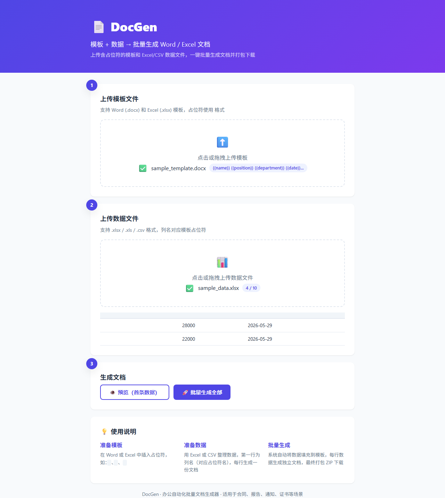

# 📄 DocGen — 办公自动化批量文档生成器

> 模板 + 数据 → 一键批量生成 Word / Excel 文档

DocGen 是一款轻量级办公自动化 Web 工具，上传含占位符的 Word/Excel 模板和 Excel/CSV 数据文件，即可批量生成文档并打包下载。

---

## ✨ 功能特性

- 🔄 **批量生成**：一行数据生成一份文档，支持 Word (docx) 和 Excel (xlsx)
- 🔍 **占位符自动检测**：上传模板后自动识别 {{变量名}} 占位符
- 👁️ **预览功能**：生成前先用首条数据预览效果
- 📦 **一键打包**：全部文档自动打包 ZIP 下载
- 🎨 **简洁界面**：三步向导式操作，拖拽上传

## 📸 界面截图

|:--:|
| 首页 |

|:--:|
| 上传模板与数据 |

## 🚀 快速开始

### 环境要求

- Python 3.10+
- pip

### 安装运行

`ash
# 克隆项目
git clone https://github.com/caiwennmin/docgen.git
cd docgen

# 安装依赖
pip install -r requirements.txt

# 启动服务
python app.py
`

浏览器打开 http://127.0.0.1:5050

## 📖 使用说明

### 1. 准备模板

在 Word 或 Excel 文件中插入占位符，格式为 {{变量名}}：

`
尊敬的 {{客户姓名}} 先生/女士：

感谢您选择我们的服务！合同编号：{{合同编号}}
本合同金额：¥{{金额}}，签订日期：{{签约日期}}
`

### 2. 准备数据

用 Excel 或 CSV 整理数据，第一行为列名（对应模板中的占位符）：

| 客户姓名 | 合同编号 | 金额 | 签约日期 |
|---------|---------|------|---------|
| 张三 | HT-001 | 50000 | 2026-01-15 |
| 李四 | HT-002 | 32000 | 2026-02-20 |
| 王五 | HT-003 | 78000 | 2026-03-10 |

### 3. 生成文档

1. 上传模板 → 系统自动识别占位符
2. 上传数据 → 预览数据内容
3. 点击「批量生成」→ 下载 ZIP 压缩包

## 🛠️ 技术栈

| 层级 | 技术 |
|-----|------|
| 后端框架 | Flask |
| 文档处理 | python-docx, openpyxl |
| 数据处理 | pandas |
| 前端 | 原生 HTML/CSS/JS |
| 样式 | CSS 自定义属性 |

## 📁 项目结构

`
docgen/
├── app.py                 # Flask 应用主程序
├── requirements.txt       # Python 依赖
├── templates/
│   └── index.html         # 前端页面
├── static/
│   ├── css/style.css      # 样式
│   └── js/app.js          # 前端交互
├── screenshots/           # 项目截图
├── uploads/               # 上传目录（含示例文件）
├── LICENSE
└── README.md
`

## 📝 适用场景

- 📋 批量生成劳动合同、保密协议
- 📊 自动填充 Excel 报表模板
- ✉️ 批量生成通知函、邀请函
- 🧾 报价单、发票、收据生成
- 🏅 证书、奖状批量制作

## 📄 License

MIT License — 详见 [LICENSE](LICENSE) 文件

