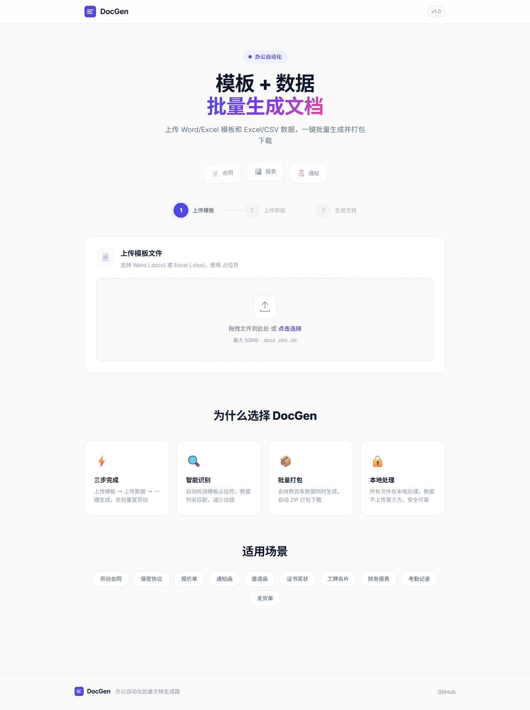

<div align="center">
  
</div>

<h1 align="center">📄 DocGen</h1>
<p align="center">
  <b>模板 + 数据 → 一键生成</b><br/>
  批量生成 Word / Excel 文档的轻量级办公自动化工具
</p>

<p align="center">
  
  
  
  
</p>

---

## ✨ 功能亮点

<table>
  <tr>
    <td width="50%"><b>🔄 批量生成</b><br/>一行数据生成一份文档，支持 Word 和 Excel</td>
    <td width="50%"><b>🔍 智能识别</b><br/>上传模板后自动检测 <code>{{变量名}}</code> 占位符</td>
  </tr>
  <tr>
    <td><b>👁️ 实时预览</b><br/>生成前先用首条数据预览效果，确保无误</td>
    <td><b>📦 一键打包</b><br/>所有文档自动 ZIP 打包，方便下载分发</td>
  </tr>
  <tr>
    <td><b>🎨 现代界面</b><br/>三步向导式操作，支持拖拽上传</td>
    <td><b>🔒 本地处理</b><br/>数据不上传第三方，安全可靠</td>
  </tr>
</table>

## 📸 界面预览

<div align="center">
  
  <p><em>DocGen 完整界面预览</em></p>
</div>

## 🚀 快速开始

> 环境要求：**Python 3.10+**

```bash
# 克隆项目
git clone https://github.com/caiwennmin/docgen.git
cd docgen

# 安装依赖
pip install -r requirements.txt

# 启动服务
python app.py
```

浏览器打开 **http://127.0.0.1:5050** 即可使用。

## 📖 使用教程

### 第一步：准备模板

在 Word 或 Excel 中插入 `{{变量名}}` 格式的占位符：

```
尊敬的 {{客户姓名}} 先生/女士：

感谢您选择我们的服务。
合同编号：{{合同编号}}
合同金额：¥{{金额}}
签订日期：{{签约日期}}
```

### 第二步：准备数据

用 Excel 或 CSV 整理数据，第一行为列名（对应模板中的占位符），每行生成一份文档：

| 客户姓名 | 合同编号 | 金额 | 签约日期 |
| --- | --- | --- | --- |
| 张三 | HT-001 | 50,000 | 2026-01-15 |
| 李四 | HT-002 | 32,000 | 2026-02-20 |
| 王五 | HT-003 | 78,000 | 2026-03-10 |

### 第三步：生成文档

1. 点击或拖拽上传模板文件 → 系统自动识别占位符
2. 上传数据文件 → 预览数据内容
3. 点击「批量生成全部」→ 下载 ZIP 压缩包

## 🛠️ 技术栈

| 层级 | 技术 |
| --- | --- |
| 后端框架 | Flask |
| 文档处理 | python-docx · openpyxl |
| 数据处理 | pandas |
| 前端 | Vanilla JS · CSS Custom Properties |
| 字体 | Inter · Noto Sans SC |

## 📁 项目结构

```
docgen/
├── app.py                # Flask 应用主程序
├── requirements.txt      # Python 依赖
├── templates/
│   └── index.html        # 前端页面
├── static/
│   ├── css/style.css     # UI 样式
│   └── js/app.js         # 交互逻辑
├── screenshots/          # 项目截图
├── uploads/              # 示例模板和数据
├── LICENSE               # MIT 开源协议
└── README.md
```

## 📝 适用场景

`劳动合同` · `保密协议` · `报价单` · `通知函` · `邀请函` · `证书奖状` · `财务报表` · `考勤记录` · `发货单` · `工牌名片`

## 📄 License

MIT © [caiwennmin](https://github.com/caiwennmin)
